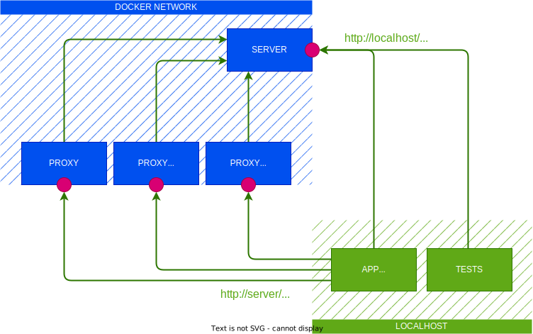

# fetch

This is the HTTP client that must be used by both Hackolade Studio and its plugins.
It takes into account the proxies and the custom certificate authorities that are configured at the level of the operating system.
So it removes the need for the end user to deal with network settings in Hackolade Studio.

## Context

Web browsers provide natively the [Fetch API](https://developer.mozilla.org/en-US/docs/Web/API/Fetch_API).
In Electron, that API was originally only available in the `renderer` process (which is basically a browser).
It is now also available in the `main` process and in `utility` processes via [net.fetch](https://www.electronjs.org/docs/latest/api/net#netfetchinput-init).

## Approach

This library returns the proper implementation of *fetch()* depending on the runtime context:

- it returns the native [Fetch API](https://developer.mozilla.org/en-US/docs/Web/API/Fetch_API) in a browser, as well as in a Electron `renderer` process
- it returns [net.fetch](https://www.electronjs.org/docs/latest/api/net#netfetchinput-init) in the Electron `main` and `utility` processes

## Tests components

We need to test that this library behaves as expected in various situations, whatever the OS of the user:

- in both the `main` process, a `renderer` process and a `utility` process
- when connecting directly to a server (aka when no proxy is involved)
- when connecting to a server that uses a self-signed certificate whose authority has been installed in the trust store of the OS
- when connecting to a server through a proxy that has been configured at the level of the OS
- when connecting to a server through a proxy that requires basic authentication
- when connecting to a server through the proxy returned by a [PAC file](https://en.wikipedia.org/wiki/Proxy_auto-config)

In order to perform those tests, we have prepared multiple components:

|Component|URL|Description|
|-|-|-|
|`server`|On your host (direct access): <br> http://localhost:8080 <br> https://localhost:4443 <br><br> In Docker network (access through proxy): http://server:8080 <br> https://server:4443|This server exposes the following REST endpoint: <br> `PUT /initiators/:connectionType/:initiator` <br> It allows clients to register themselves using arbitrary routes: <br> `/initiators/direct/main`, `initiators/proxy/renderer`, etc. <br><br> This server also exposes the following REST endpoint: <br> `GET /initiators/:connectionType/:initiator` <br> It can be used to check if a given client managed to reach the server to register itself.|
|`app`|NA|This is an Electron application. It contacts the server from both the *main* process, a *renderer* process and a *utility* process. Each process registers itself as a distinct `:initiator`: `main`, `renderer` and `utility` respectively. The base URL of the endpoint - including the `:connectionType` - is passed to the application through an environment variable, making it possible to start different instances of the application to cover different cases (e.g. direct connection, connection through a proxy).|
|`proxy`|http://localhost:3128|This is a proxy that does not require authentication.|
|`proxy-basic-auth`|http://localhost:3129|This is a proxy that requires basic authentication. You can use `user1` as both username and password.|
|PAC file|http://localhost:8081/proxy.pac|This is a PAC file that leads to using the proxy that does not require authentication.|
|`tests`|NA|This is a set of tests that query the REST API of the server to verify that all clients could successfully register themselves, whatever the context of the connection.|



## Test pre-requisites

Follow the instructions below prior to executing the tests:

- Install both `node/npm` and `docker`.
- Run `npm install` in this repository.

## Test automation

If your OS is **Linux or MacOS**, then you can run the command below to execute the automated tests.

```sh
npm run docker:test
```

:warning: Those tests validate the behavior of the library in Docker/Linux. Validating the library for MacOS and Windows involve manual steps that are documented below.

## Test direct connection

In this case, the app connects directly to the server. There is no intermediate proxy involved.

:white_check_mark: **Linux**: this case is covered by the automated tests.

:white_check_mark: **MacOS**: follow the instructions below.

1. Start the server with `npm run docker:server`.
1. Start the application with `npm run test:app:direct`.

## Test connection involving a self-signed certificate

For a certificate to be considered valid, it must be signed by a trusted certificate authority (CA), such as *GlobalSign* or *DigiCert*.
Obtaining such a certificate used to cost some money (this is not true anymore thanks to *[Let's Encrypt](https://letsencrypt.org/)*, a nonprofit certificate authority).
That's why some organizations generated their own self-signed certificates, typically for internal use.
Those certificates are free.
However, they are unsafe and prevent HTTPS connections from being established.
To be able to use self-signed certificates, an organization must add itself to the list of trusted certificate authorities in the OS of all its users.

:white_check_mark: **Linux**: this case is covered by the automated tests. Note that the custom certificate authority must be added to the *NSS Shared DB* (see instructions [here](https://chromium.googlesource.com/chromium/src/+/master/docs/linux/cert_management.md)).

:white_check_mark: **MacOS**: follow the instructions below.

1. Start the server with `npm run docker:server`.
1. Open the MacOS *Keychain Access*.
1. Click on *File* > *Import Items*.
1. Select the certificate [./test/resources/certs/gen/rootCA.crt](./test/resources/certs/gen/rootCA.crt).
1. Locate the certificate that you just imported in your keychain (it is named *Hackolade-Test-Root-CA*) and double click on it.
1. In the *Trust* section of the details dialog, choose to *Always Trust* the certificate for SSL.
1. Close the details dialog to apply your changes.
1. Start the application with `npm run test:app:cert`.
1. [Optional] You can remove the certificate from your keychain.

## Test connection through a proxy

In this case, the app connects to the server through a proxy.

:white_check_mark: **Linux**: this case is covered by the automated tests. Note that the proxy is configured through the environment variables `HTTP_PROXY` and `HTTPS_PROXY`, which is the standard way of configuring proxies in Linux.

:white_check_mark: **MacOS**: follow the instructions below.

1. Start the server with `npm run docker:server`.
1. Open the MacOS *System Settings*.
1. Select *Network* in the left menu.
1. Navigate to the details of your network connection.
1. In the details dialog, select *Proxies*.
1. Enable *Web proxy (HTTP)* and provide the following settings:
    - Server: localhost
    - Port: 3128
    - No authentication required
1. Click on *OK* to apply your changes.
1. Start the application with `npm run test:app:proxy`.
1. Turn off the proxy.

## Test connection through a proxy with basic auth

In this case, the app connects to the server through a proxy that requires a username and a password. Even though the credentials might have been set at the level of the operating system, the user needs to provide them interactively to the Electron application. Note that this is also the case for other apps such as Slack or Docker Desktop.

The `main` process must handle the [login](https://www.electronjs.org/docs/latest/api/app#event-login) event and prompt the user for the proxy credentials.

```js
const { app } = require('electron');

app.on('login', (event, webContents, details, authInfo, callback) => {
  // Prevent the default behavior since it cancels all authentications.
  event.preventDefault();

  // Prompt the user for credentials
  // ...

  callback(username, password);
});
```

The `login` handler will be called automatically for both the `main` process and a `renderer` process.
For a `utility` process, the option [respondToAuthRequestsFromMainProcess](https://www.electronjs.org/docs/latest/api/utility-process#utilityprocessforkmodulepath-args-options) must be set to `true` when creating it.

```js
const { utilityProcess } = require('electron');

utilityProcess.fork(..., { respondToAuthRequestsFromMainProcess: true });
```

:white_check_mark: **Linux**: this case is covered by the automated tests. Note that the proxy is configured through the environment variables `HTTP_PROXY` and `HTTPS_PROXY`, which is the standard way of configuring proxies in Linux.

:white_check_mark: **MacOS**: follow the instructions below.

1. Start the server with `npm run docker:server`.
1. Open the MacOS *System Settings*.
1. Select *Network* in the left menu.
1. Navigate to the details of your network connection.
1. In the details dialog, select *Proxies*.
1. Enable *Web proxy (HTTP)* and provide the following settings:
    - Server: localhost
    - Port: 3128
    - Username: user1
    - Password: user1
1. Click on *OK* to apply your changes.
1. Start the application with `npm run test:app:proxy-basic-auth`. Note that you won't be prompted for credentials because we hardcoded them.
1. Turn off the proxy.
